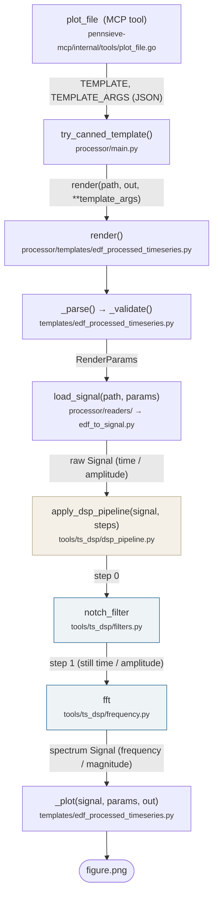

# How a request flows through the processor

This page follows one request through the code, function by function. The
top-level [README](../README.md) covers what the repo is and how to run it;
this one is for reading the code.

**Example request used throughout:** *"For `XXXX.edf`, view channel F7 as
the montage F7-Fp1, from 500 s after onset for 50 s; notch out mains hum, then
show the FFT."*

## The shape



White boxes are the fixed path every request takes. The tan box is the
pipeline runner. Blue boxes are the DSP tools, chosen by name at run time from
the request's `pipeline` list; they are the only part that differs between
requests.

Three folders, three jobs:

| folder | job | in → out |
|---|---|---|
| `templates/` | what to draw | user's `template_args` → `figure.png` |
| `readers/` | file → Signal | path + `RenderParams` → raw `Signal` |
| `tools/ts_dsp/` | Signal → Signal | `Signal` + step list → processed `Signal` |

`Signal` itself (`tools/ts_dsp/signal_definition.py`) is the contract all
three share: `t`, `y`, `fs`, `channel`, and four axis-metadata fields
(`x_domain`, `x_unit`, `y_domain`, `y_unit`) that say what the numbers
currently mean.

## Step by step

### `plot_file` — `pennsieve-mcp/internal/tools/plot_file.go`

The AI model reads the tool description (generated from
`schema/templates.json` and `schema/ts_tools.json`) and translates the user's
sentence into a template name plus arguments:

```json
{ "template": "edf_processed_timeseries",
  "template_args": { "channel": "F7", "channel2": "Fp1",
                     "start_time": 500, "duration": 50, "time_unit": "s",
                     "pipeline": [ {"tool": "notch_filter", "params": {"w0": 60}},
                                   {"tool": "fft", "params": {}} ] } }
```

`template_args` is JSON-encoded and forwarded unchanged (workflow →
`handler.py` → environment variable `TEMPLATE_ARGS`). Nothing along the way
inspects or normalises the pipeline list; the first code that does is the
pipeline runner.

**Output:** two environment variables, `TEMPLATE` and `TEMPLATE_ARGS`.

### `try_canned_template()` — `processor/main.py`

Unpacks `TEMPLATE_ARGS` back into a dictionary, looks the template up by name
in the template registry (`templates/__init__.py`), and calls its `render()`
with the file path, the output path and the argument dictionary.

**Output:** `render(target_file_path, output_path, **template_args)`.

### `render()` — `processor/templates/edf_processed_timeseries.py`

Five lines, one per step below. The only thing it checks itself is the file
extension, which needs no file access.

```python
params = _parse(...)                                   # step 1
_validate(params)                                      # step 1
signal = load_signal(target_file_path, params)         # step 2
signal = apply_dsp_pipeline(signal, params.pipeline)   # step 3
_plot(signal, params, output_path)                     # step 4
```

### Step 1 — `_parse()` and `_validate()` — same file

`_parse` turns the raw dictionary into typed values: `start_time=500` is a
number (not a clock string), `time_unit="s"` means seconds, no `y_range` or
`y_unit` was given, and a second channel was given so this is a montage.

`_validate` applies the rules that need only the user's inputs: channel and
start time present, at least one of end time / duration, the two montage
channels differ. Neither function opens the file.

**Output:** a `RenderParams` — `channel="F7"`, `channel2="Fp1"`,
`montage=True`, `start=500 s`, `duration_s=50`, `y_limits=None`,
`volt=None`, `pipeline=[…]`.

### Step 2 — `load_signal(path, params)` — `processor/readers/`

`readers/__init__.py` sees `.edf` and hands off to `edf_to_signal.py`, which
works in four functions:

1. `_read_header` — open the EDF with pyedflib and read only the header:
   channel names, sampling rate, recording length and unit per channel, and
   the recording's start time of day.
2. `_check_against_header` — everything about the request that could only be
   checked with the header in hand: F7 and Fp1 exist and share a sampling
   rate; the window 500–550 s lies inside the recording and under the 600 s
   cap; no `y_unit` was given, so use the unit the file declares for F7
   (here µV). A clock-string start time would be anchored to the recording's
   start time here.
3. `_read_channels` — read F7 and Fp1 between 500 s and 550 s; subtract to get
   the montage.
4. `_build_signal` — convert to µV and package as a `Signal`.

Rule of thumb for where a check lives: if it can be done without the file it
is in `_parse`/`_validate`; if it needs the header it is in the reader.

**Output:** a raw `Signal` — `t` in seconds from recording start (500 … 550),
`y` in µV (F7 minus Fp1), `fs`, `channel="F7-Fp1"`, `x_domain="time"`,
`y_domain="amplitude"`, `recording_start_clock_s` from the header.

### Step 3 — `apply_dsp_pipeline(signal, steps)` — `tools/ts_dsp/dsp_pipeline.py`

The template forwards the pipeline list without knowing which tools exist.
The runner goes through the steps in order; for each one it

1. looks the tool name up in `_REGISTRY`, the dictionary built from the
   explicit `ALL_TOOLS` list in `tools/ts_dsp/__init__.py`;
2. checks the parameters — all required ones present, no unknown ones;
3. checks the `Signal` is the right kind of data for this tool (each tool
   declares `requires`, e.g. a filter needs `x_domain="time"`, `y_domain="amplitude"`);
4. runs the tool, which returns a new `Signal`.

**Step 0 — `notch_filter(signal, w0=60)`** (`filters.py`). Gate passes: the
signal is a time trace of voltage. Builds a narrow scipy filter centred on
60 Hz and runs it forwards and backwards so the trace is not shifted in time.
Returns the same `t`, filtered `y`; domains unchanged (`produces={}`).

**Step 1 — `fft(signal)`** (`frequency.py`). Gate passes: still time /
amplitude after the notch. Computes how much of each frequency is present in
the 50 s trace. Returns a `Signal` whose x-axis is now frequency in Hz and
whose y-axis is magnitude in µV (`x_domain="frequency"`,
`y_domain="magnitude"`).

Had the user asked for fft *then* notch, step 1 would fail the gate with
`notch_filter expects x_domain='time', but the signal is x_domain='frequency'`.

**Output:** the spectrum `Signal`, back to `render()`.

### Step 4 — `_plot(signal, params, output_path)` — same file as `render()`

The y-axis is no longer voltage, so a voltage `y_range` would be ignored and
the axis is scaled to the data. The x-axis is formatted from `params`: numeric
input → plain numbers in the user's unit; clock input → H:M:S ticks anchored
at `signal.recording_start_clock_s`. A spectrum is drawn as-is. Axis labels
come straight off the `Signal` (`"frequency (Hz)"`, `"magnitude (µV)"`).

**Output:** `OUTPUT_DIR/figure.png`.

### Back in `main.py`

`figure.png` exists, so the run succeeds. Had any step raised
(`RuntimeError`, or `ToolInputError` from the pipeline), `try_canned_template`
logs it and the processor falls back to the LLM agent loop.

## Adding things

* **A tool:** write a `Signal -> Signal` function in the matching
  `tools/ts_dsp/` module, decorate it with `@dsp_tool(...)`, add it to
  `ALL_TOOLS` in `tools/ts_dsp/__init__.py`, run `make schemas`.
* **A file format:** add `readers/<format>_to_signal.py` exposing
  `load_signal(path, params) -> Signal`, register its extension in
  `readers/__init__.py`, add the extension to the template's
  `SUPPORTED_EXTENSIONS`. The template and the tools do not change.
* **A template:** see "Adding a canned template" in the top-level README.
